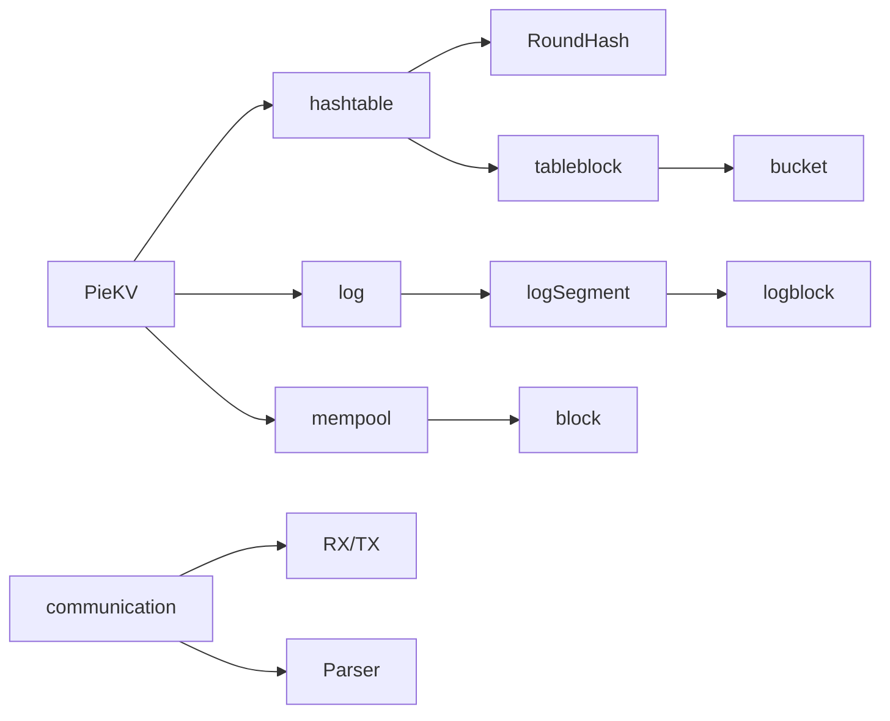
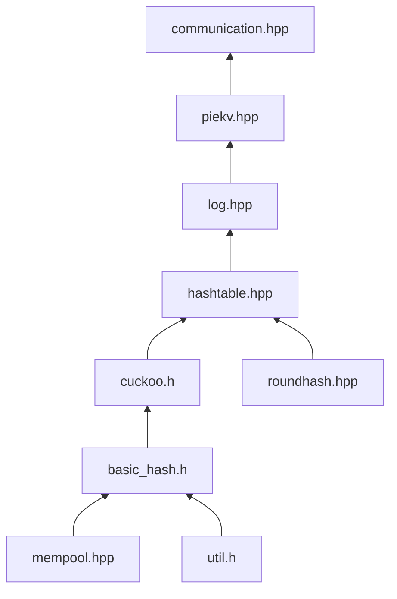

## Class Structure

```mermaid
graph LR
	PieKV --> hashtable	
	PieKV --> log
	PieKV --> mempool
	
	hashtable --> RoundHash
	hashtable --> tableblock
	tableblock --> bucket

	log --> logSegment

	logSegment --> logblock

	mempool --> block

	communication --> RX/TX
	communication --> Parser
	

```

## headers‘ dependencies

```mermaid
graph BT
	
basic_hash.h --> cuckoo.h

%%basic_hash.h --> bc>basic_hash.c]
%%basic_hash.h --> hp>hashtable.cpp]

%%communication.hpp --> cp>communication.cpp]
%%communication.hpp --> mp>main.cpp]

cuckoo.h --> hashtable.hpp

%%cuckoo.h --> cc>cuckoo.c]

hashtable.hpp --> log.hpp

%%hashtable.hpp --> hp>hashtable.cpp]

log.hpp --> piekv.hpp
%%log.hpp --> mempool.hpp

%%log.hpp --> lp>log.cpp]

mempool.hpp --> basic_hash.h

%%mempool.hpp --> mp>mempool.cpp]

piekv.hpp --> communication.hpp

%%piekv.hpp --> fp>flowing_controller.cpp]
%%piekv.hpp --> op>operation.cpp]

roundhash.hpp --> hashtable.hpp

%%roundhash.hpp --> rp>roundhash.cpp]

%%util.h --> zipf.h
util.h --> basic_hash.h

%%zipf.h --> NO_INCLUDE


```