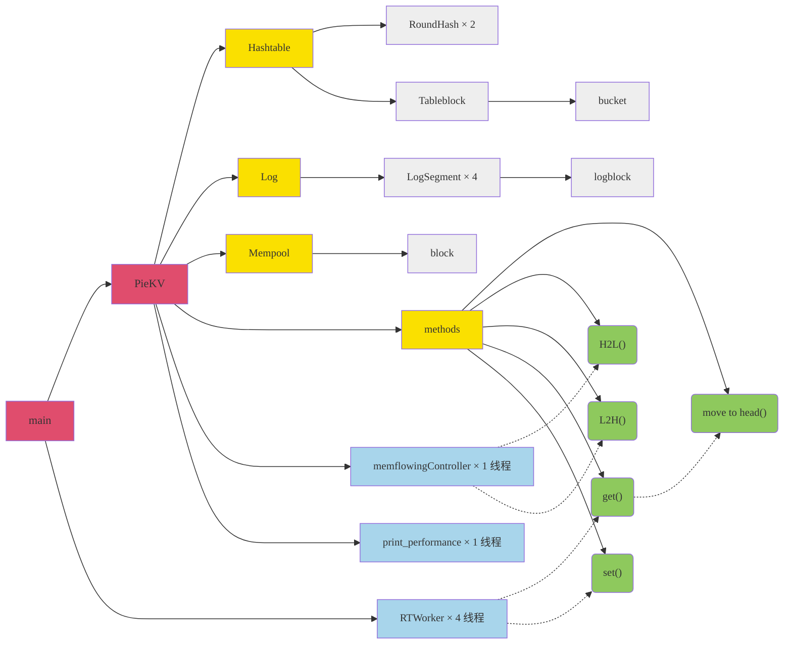
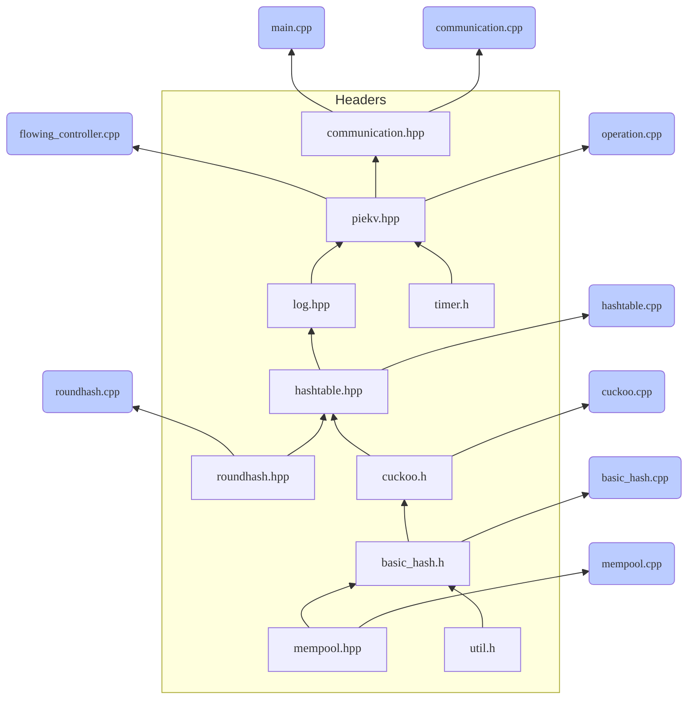

## Start
- Server运行(目前dpdk环境配置10.176.64.41参数)：
	- PieKV/build/exp.sh(运行并记录log)
	- PieKV/build/go.sh(仅运行)
- Client运行(目前dpdk环境配置10.176.64.36参数)：
	- Client/test.sh（运行2秒）
	- 也可使用Client/build/client -h自行查看参数使用方法
## Class Structure

## headers‘ dependencies

