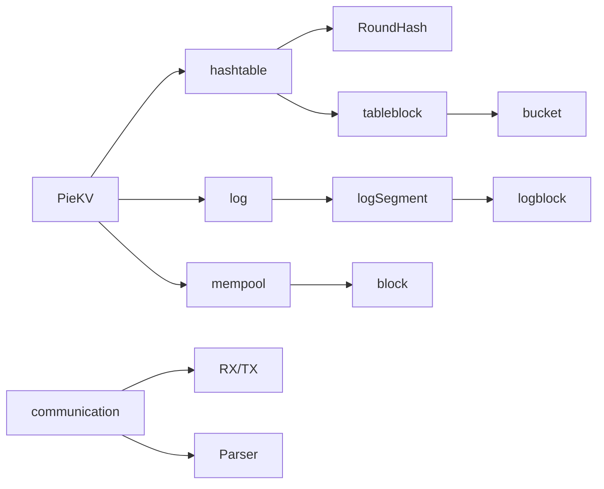
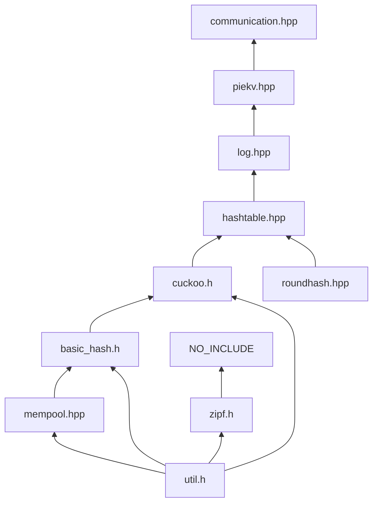

## Class Structure

- Super Class
    - Class HashTable
        - Class RoundHash round_hash_
            - uint64_t num_long_arcs
            - uint64_t num_short_arcs
            - uint64_t num_long_arc_group
            - uint64_t num_arc_group
            - uint64_t curent_s
            - uint64_t S_
            - uint64_t S_minus_one
            - uint64_t S_log
            
            Fuction:
            
            - RoundHash()
            - get_block_num() ✔️
            - ArcNum() ✔️
            - HashToArc() ✔️
            - ArcToBucket() ✔️
            - HashToBucket() ✔️//原计算函数`RoundHash()`
            - NewBucket() ✔️
            - DelBucket() ✔️
            - get_parts_to_remove() ✔️
            - get_parts_to_add() ✔️
            - ~RoundHash()
        - Struct table_block[MAX]
            - void * blockptr
            - uint32_t blockID
        - Struct bucket ALIGNED(64)
            
            uint32_t version;
            
            uint8_t occupy_bitmap;2222222222
            
            uint8_t lock;//???
            
            uint16_t padding;
            
            uint64_t item_vec[7];//***8bit tag+8bit round+48 GID&offset***
            
        - Struct TableStats table_stats_
        - uint32_t table_block_num_
        
        function:
        
        - HashTable()  ✔️
        - get_block_ptr() ✔️
        - get_block_id() ✔️
        - AddbBlock() ✔️
        - RemoveBlock() ✔️
        - ShrinkTable() ✔️
        - ExpandTable() ✔️
        - ~hashtable()
    - Class log [mulitple threads]
        - class logSegment[MAX]
            - struct logblock
                - uint8_t blockptr
                - uint32_t blockID
                - uint32_t Residue
            - struct store_stats
            - uint32_t numPages
            - uint32_t usingPage
            - uint32_t offset (page内offset，与usingPage组合为tail,用于实现近似LRU)
            - uint8_t round;//当前log线程总轮次
        - uint16_t totalNumPage
        - uint16_t resizingPointer
        
        fuction:
        
        - log()
        - shrink() ✔️
        - expand() ✔️
        - locate_item()( 原log_item_locate() ) ✔️ 移动到mempool
        - alloc_item() ✔️移动到logsegment
        - ~log()
    - Class mempool
        - Struct block
            - void* addr；
            - uint32_t in_use;
        - size_t block_size
        - uint32_t numBlocks;
        - uint32_t numUsedBlocks;
        
        function:
        
        - mempool()//pagesize 大小变化
        - get_block_size() ✔️
        - get_block_addr() ✔️
        - get_available_num() ✔️
        - get_partition_tail()
        - alloc_block() ✔️
        - clean_blocks()
        - ~mempool()
    - DPDK通信相关
        - structs
        - ……
        
        fuction：
        
        - constructor()
        - Parser()
        - Rx_loop()
        - Tx_loop()
        - DPDK_Server()
        - destructor()
    
    fuction:
    
    - Constuctor()
    - H2L()
    - L2H()
    - mem_flowing_controller()
    - get()//完成后获取offset与tail对比，用于实现近似LRU
    - set()
    - Destructor()

## headers‘ dependencies

