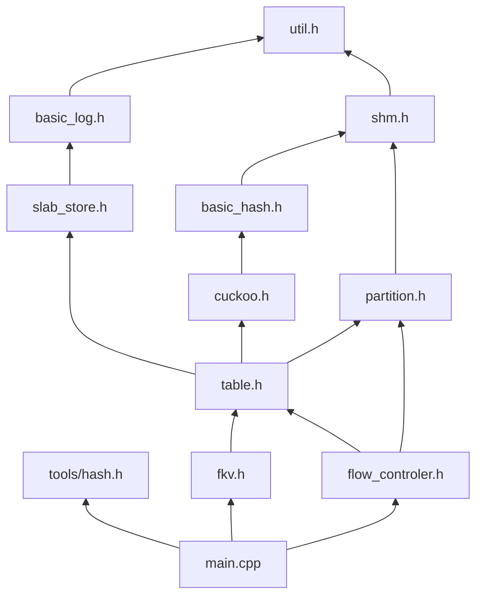
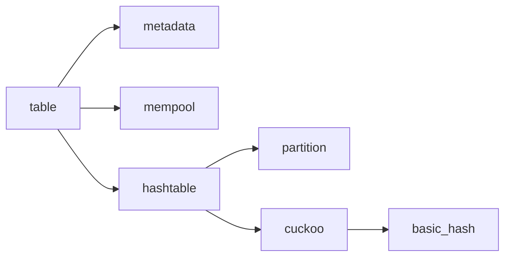

# FlexibleKV

#### Temporary Principle

**Plan**:

- Design how to trigger memory flowing

- Asynchronous Expand/Shrink of Log Instance(s)

- The flag `is_flexibling` of hash table should be changed to **OCC**?

Instead of doing move_h2t exhaustively to create the conditions of expanding/shrinking log instance(s), we can do this in a asynchronous way. The following steps is a naive plan.

1. Set a semaphore to indicate we need a expand/shrink.
2. Check the current condition whether satisfy.
3. When satisfied, lock the log instance and update the system state.
    - In case we miss the condition for the lantency of acquiring the log lock, we can acquire the lock a little earlier and do a small amount of move_h2t.

- One keyhash maps to two bucekts. ($second_bucket = tag ^ bucket_index$)
    0. Redistribution [Here is an assumption: When shrinking, there are lots of empty slots. So compaction won't lose too many entry. When expanding, all can find an empty one to move to.]
        - Not from one bucket to another bucekt with the same bucekt index.
        - Find is there an empty slot in its corresponding two bucket if new partition. If no, eviction happens in the first bucket.
    1. `SET`
        - get partition index.
        - Is there any empty slot in the two? Just check `bitmap`. `is_entry_expired` only be called during calc oldest. Note: using the `bitmap` to achieve early pruning may be trivial.
        - find the oldest one (within the bucket indexed by `bucket_index`) and release the other bucket's lock.
        - insert and release the lock.
    2. `GET`
        - Check the older two buckets. And then the newer two if failed in the older.
    3. Oreder with in the two buckets
        - First bukcet: keyhash & `BPP`, denoted as `bucket_index`.
        - Second bucekt: `bucket_index` ^ tag. (tag = (key_hash >> 16) & TAG_MASK)

#### How to impelement page_usage_H2L?

1. **Make a page empty** Distribute entries in the selected partition to other partitions.
2. **Keep service available** Keeps two versions of info for partion, `bf` and `af`. Use a bit to indicate which version should be accessed normally.
3. **Append to log when `tail` reaching the boundary** Avoiding evicting deliberately, when the tail reaches the old end boundary, append the page. ***This is optional***, which can be set aside for a while.

### Current Qestions:

- Multiple writers concurrent writes. (Two candidate design choices.)
    - **Orchestrate Multiple Log Instances** We pyhsically intersects log instances and hash table blocks in virtual memory address. All instances are identical to each other. A given item can be stored in any instace depending on which one is available for load balancing among instances.
    - **Shrink Critical Section** Writes are always happening at the `tail` of the log, and evicting are always happening at the `head` of the log. It log is big enough and writers is not too many. Writers will not affect others. So it is feasible that the lock of the log only be held when updating the log status (e.g. round, head, tail, etc). Writers can writes in parallel. It just serilizes the memory allocation phase in log.

- When free a segment (partition), we should ensure no readers are using the segment.
    - It is needless. If a reader tries to access an invaild segment, it will fail and try to access the correct one.
    - It is not a big deal for happening rarely.

- Infinite `set` needs `expired_entry_clean` to avoid expired entry be valid when `round` round. (Not shown until now.)

- `table.stats.count` works incorrectly. (Not shown until now.)

### Notes:

- `H2L` and `L2H` cannot run concurrently.

- After finishing an `move_h2t`, we should update both the `offset` and **`local_round`** parts of the correspoding entry. (Don't make the same mistake once again.)

- The loop order within `redistribute` is related to performace. (I think current order is good.)
    - But the current version of `redistribute`s cannot do batch adjust. It adjust one page size per round.

##### \* Good NEWS

- Leaving one page between circular log and index can achieve the same effect as mica do by using `mmap` to impelement the idea of `circular`, which has the same virtual memory space overhead.

- The concept of _round_ introduced for simplifying opertations on circular log also eases the function `find_empty_or_oldest`, which benefits from the concept of `round`.
    - Choose an entry with the minimum `local_round`.
    - For entries with the same `local_round` value, their `offset`s reflect how long they are inserted into the log.

- In `struct` `hash_table`, we make member `is_setting` and `is_flexibling` adjacent. So we can take the two a `uint64_t` as a whole, and use built-in function `__sync_bool_compare_and_swap` to update system state in an atomic way.
    - To further take advantage of this idea, is adding `current_version` updating into this procedure necessary?

#### Questions & Todo List

- How to automatic adjust memory ratio index/data?

    - First, achieve multi-threding `get` with one `set` while `H2L` or `L2H` is running in the background.
        - ✅ Concurrent `set` and `get` is OK?
        - ✅ Set a `bool` variable `is_flexibling` to indicate whether `H2L`/`L2H` is running background.
        - ✅ When `is_flexibling` is set, `set` do in `!current_version`, and `get` do in `current_version` first then `!current_version` if failed in `current_version`.

    - ⏸☑️ Collect stats to track memory pressure for trigger `H2L`/`L2H`, like `used_memory` of circular log, `load factor` of hash table.
        - `used_mem`: space between `head` and `tail`. This can be calculated by $tail - head$.
        - `actual_used_mem`: `used_mem` - `expired_mem`
            - ☑️ We first track `actual_used_mem`, other info might added if needed. (need to check correctness)
        - current load of hash table can be derived from `table.stats.count`. So `load factor` can be computed.
        - ✅ `GC` can be introduced. (A naive `GC` is implemented currently.)
        - The expired items in the middle of the log can be thought as `external fragment`. So this procedure can be called `defragmentation`. ⏰ How to implement this❓
            - Now, we implement a simplest GC on for the log, cleaning expired items at the `head` of log.
            - The garbage in the middle of the log needs to be took into consideration when deciding whether operates a `H2L` or `L2H`.

    - A `mem_controler` thread call `H2L`/`H2L` when _some conditions_ are satisfied.
        - How is be auto elegantly❓ We now exhaustively checks whether some conditions are satisfied.
        - ➡️ How to trigger memory flowing? Now, for simplicity, we create a daemon thread checks system status. **BUT** how to decide whether trigger or not? Currently, we work on this. Then we should consider how to do experiments.
        - ✅ **concurrent operations on hash table** should take into consideration here.

- `GC` on index entry needs too many operations.
    - ⏰ The "**periodical**" should be redesigned.
    - I think this is a non-trivial component, which cleans expired index entries increasing the possibility of `is_entry_expired` falling to logical short circuit.
    - Is there any possibility for optimizing it❓ The essential thing needs to be done is redsigning the concept of `round`.

- ⏸ Orchestrate Multiplt Log Instance
    - Writes on log are serialized by lock. To achieve high performance under write intensive workload, the simplest way can be imagined is managing multiple log instances.
    - Is there any other better way for this purpose❓
        - Let one log instance supporting write concurrency. Is this idea pratical?

- ⏸ SIMD Speedup
    - Probing hash table can using SIMD to speedup.

- ✅ Impl MICA's microbench on FlexibleKV. &nbsp;&nbsp; ( ❗️need to be checked. )
    - Now, the items' size are identical, 40 Bytes.
    - What is the purpose of this❓
        - Test its I/O under normal status. Can it be comparable with MICA?

- ⏰ _lock_ need to be redesigned more carefully and in a finer granularity.

- ❎ Why we choose round-hashing? Why not extendible hashing or linear hashing?

    - Test performance of consistent hashing, like evenly distributed, a high load factor.
        - Load balance: insert, displayment

    - Test whether system is reliable under different workload.
        - Workload property: distribution of key value, distribution of item size.

    - Test the performance of our hashing scheme under different workload, uniform or zipf with various volume.
        - ⏰ Decide a better configuration, $S_0$, bucket size, partition size.

#### Code Dependency

#### OO Design

#### Function Path

- `set` path:
    - increase bucket version
    - find target entry to be set
    - lock log
    - make a space of item
    - write item
    - set evicted item expired if need eviction (Do we need to tag items with `expired`?)
    - unlock log
    - set entry
    - increase bucket version

- `get` path:
    - read bucket version
    - find entry or not found (read version to decide whether try again). (`tag` &rarr; `is_entry_expired`; &rarr; `key`)
    - get item
    - check `is_entry_expired`, read bucket version again and retry if it not the same
    - (_optional_) clean the entry or `h2t`. (Let's do if later.)
    - **note**: For `get` operation, it doesn't need to get the log lock. If a `get` pass the `read_version_begin`, the corresponding items is OK to access. So, everyone access the lock in the order: `bucket version` then `log lock`.

- `H2L` path:
    - do `DelBucket`
    - set `is_flexibling` in `distrubute_last_short_group`
    - shrink `H`
        - read one bucket version and distribute it to other buckets
            - read version, write entry, read version again (Is it necessary to clean orignal entry?)
        - update partition metadata and clean `is_flexibling`
    - clean `is_flexibling` and reverse `current_version` **Is the oreder of the two fine? Could it possible do the two in one atomic operation? It might possible I think.**
    - expand `L` (For navie one, do intensive `h2t` and then increase `alloc.size`)
        - `h2t`:
            - if the one at the head is expired (**current do not take this into consideration**)
                - get log lock
                - `while` loop to find the first unexpired one
                - update `head`
                - release the log lock
            - else:
                - increase bucket version corresponding to the item at the head of log
                - get the log lock
                - do `memcpy`
                - updata `head` and `tail`
                - update the entry
                - release the log lock and increase the bucket version again
    - update log metadata
        - get log lock
        - `head`, `tail`, related `round`s, `size`. (Think carefully to avoid inter-state. Is this possible?)
        - release log lock

- `L2H` path: \* In this and `H2L` we need to control the lock seqence. `bucket version` first and `log lock` next if we need to hold the two at the same time. We avoid holding the two at the same time here, trading off with possible _thrashing_.
    - shrink `L`
        - get log `lock` \* The lock grain is actually not simple like this stated here.
        - if eviction is needed &rArr; evict items
        - `h2t`:
            - \* this part is same as `H2L`
    - update log metadata
    - release log `lock`
    - do `NewBucket`
    - set `is_flexibling` in `distrubute_first_long_group`
    - expand `H`
        - read bucket version
        - ...
    - clean `is_flexibling` and reverse `current_version`

- `GC` path:
    - ✅ _periodically_ clean hash table in a certain pace
        - increase the bucket version
        - clean expired entry
        - increase the bucket version again
    - 📝 When doing `expand_circular_log`, `GC` should be stopped.
        - Within the function, it operates `move_h2t` first and then update its entry. After the `move_h2t` finished, the entry is temporarily false expired and becomes unexpired after its entry be updated. For simplicity, we just stop the `GC` during memory flowing.

#### Notions May be Helpful When doing Experiments

- Dose `malloc` need warm up?
    - After `malloc`, we cannot see memory usage change through `htop`. In `htop`, we see occupied memory grows gradually. But our program only `malloc` memory at the begaining.

 0  1  2  3  4  5  6  7, 32 36 40 44 48 52 56
16 18 20 22 24 26 28 30, 33 37 41 45 49 53 57
 8  9 10 11 12 13 14 15, 34 38 42 46 50 54 58
17 19 21 23 25 27 29 31, 35 39 43 47 51 55 59
